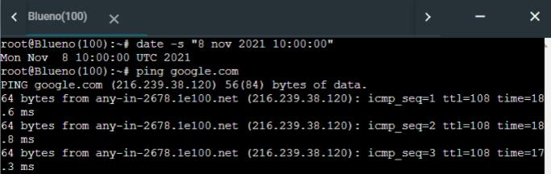
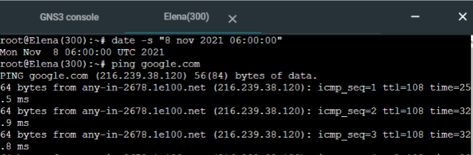
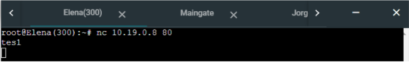
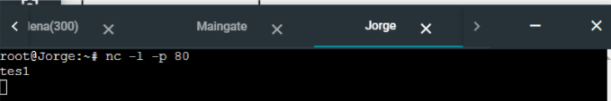
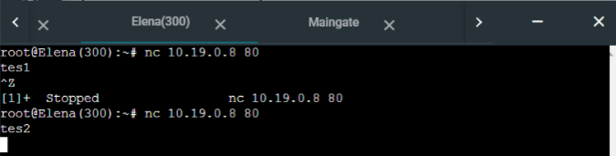
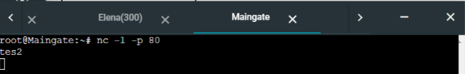

# Jarkom-Modul-5-C10-2021

## Anggota Kelompok C10
| Nama | NRP |
| ------------- | ------------- |
| Christian Bennett Robin | 05111940000078  |
| Erza Janitradevi Nadine  | 05111940000153  |
| Akmal Zaki Asmara  | 05111940000154  |

## Soal dan Pembahasan
### A
Soal : Tugas pertama kalian yaitu membuat topologi jaringan sesuai dengan rancangan yang diberikan Luffy dibawah ini
- Jipangu adalah DHCP Server
- Foosha, Water7, dan Guanhao adalah DHCP Relay
- Doriki adalah DNS Server
- Blueno, Cipher, Elena, dan Fukurou adalah client


### B
Soal : Karena kalian telah belajar subnetting dan routing, Luffy ingin meminta kalian untuk membuat topologi tersebut menggunakan teknik CIDR atau VLSM.

### Pembagian Subnet
Pembagian subnet menggunakan VLSM. Berdasarkan topologi yang telah dibuat, dapat ditentukan labelling netmask sebagai berikut


Berikut ini adalah jumlah ip untuk masing-masing subnet yang telah ditentukan. Berdasarkan total jumlah IP untuk A1 hingga A8 pada tabel berikut, didapatkan netmask /21 sebagai netmask terbesar yang akan digunakan untuk pembagian IP.

| Subnet | Jumlah IP | Netmask |	
|:------:|:---------:|:-------:|	
|   A1   |    3   |   /29   |	
|   A2   |    101    |   /25   |	
|   A3   |     701     |   /22   |	
|   A4   |      2  |   /30   |	
|   A5   |     2    |   /30   |	
|   A6   |    301   |   /23   |	
|   A7   |     201     |   /24   |	
|   A8   |    3    |   /29  |	
|  Total   |    1314    |   /21  |
### Pembagian IP

Berikut adalah pembagian IP yang diilustrasikan menggunakan tree. Pada tree berikut dapat diketahui network ID yang dapat digunakan untuk masing-masing subnet.


Berikut adalah tabel pembagian IP untuk subnet A1 hingga A8 yang terdiri dari Network ID, Netmask, dan Broadcast Address. Tabel ini dibuat untuk memudahkan pemberian IP pada GNS3.

|  A1 | Network ID        | 10.19.0.8     |	
|:---:|-------------------|-----------------|	
|     | Netmask           | 255.255.255.248   |	
|     | Broadcast Address | 10.19.0.15    |	
|  A2 | Network ID        | 10.19.0.128     |	
|     | Netmask           | 255.255.255.128 |	
|     | Broadcast Address | 10.19.0.255     |	
|  A3 | Network ID        | 10.19.4.0      |	
|     | Netmask           | 255.255.252.0|	
|     | Broadcast Address | 10.19.7.255     |	
|  A4 | Network ID        | 10.19.4.0       |	
|     | Netmask           | 255.255.252.0   |	
|     | Broadcast Address | 10.19.7.255     |	
|  A5 | Network ID        | 10.19.0.0      |	
|     | Netmask           | 255.255.255.252 |	
|     | Broadcast Address | 10.19.0.3       |	
|  A6 | Network ID        | 10.19.2.0       |	
|     | Netmask           | 255.255.254.0   |	
|     | Broadcast Address | 10.19.3.255    |	
|  A7 | Network ID        | 10.19.1.0       |	
|     | Netmask           | 255.255.255.0 |	
|     | Broadcast Address | 10.19.1.255      |	
|  A8 | Network ID        | 10.19.0.16   |	
|     | Netmask           | 255.255.255.248  |	
|     | Broadcast Address | 10.19.0.23    |
### C
Soal : Setelah melakukan subnetting, kalian juga diharuskan melakukan Routing agar setiap perangkat pada jaringan tersebut dapat terhubung. 

Sebelum melakukan routing, membuat konfigurasi untuk masing-masing node pada `Configure > Edit Network Configuration`. Konfigurasi ini dilakukan supaya kita dapat mengetahui IP address dan gateway masing-masing node sehingga dapat saling dihubungkan saat membuat routing. Berikut adalah salah satu konfigurasi yang dilakukan, yaitu pada router Foosha
```
auto eth0
iface eth0 inet static
address 192.168.122.2
netmask 255.255.255.252
gateway 192.168.122.1

auto eth1
iface eth1 inet static
	address 10.19.0.5
	netmask 255.255.255.252

auto eth2
iface eth2 inet static
	address 10.19.0.1
	netmask 255.255.255.252
```

Kemudian, Routing dilakukan antar router pada Foosha, Water7, dan Guanhao
- Foosha
```
route add -net 10.19.0.8 netmask 255.255.255.248 gw 10.19.0.2
route add -net 10.19.0.128 netmask 255.255.255.128 gw 10.19.0.2
route add -net 10.19.4.0 netmask 255.255.252.0 gw 10.19.0.2
route add -net 10.19.0.16 netmask 255.255.255.248 gw 10.19.0.6
route add -net 10.19.2.0 netmask 255.255.254.0 gw 10.19.0.6
route add -net 10.19.1.0 netmask 255.255.255.0 gw 10.19.0.6
```
- Water7
```
route add -net 0.0.0.0 netmask 0.0.0.0 gw 10.19.0.1
```
- Guanhao
```
route add -net 0.0.0.0 netmask 0.0.0.0 gw 10.19.0.5
```
### D
Soal : Tugas berikutnya adalah memberikan IP pada subnet Blueno, Cipher, Fukurou, dan Elena secara dinamis menggunakan bantuan DHCP server. Kemudian kalian ingat bahwa kalian harus setting DHCP Relay pada router yang menghubungkannya.

DHCP Server diletakkan pada Jipangu dengan file konfigurasi  `/etc/dhcp/dhcpd.conf`sebagai berikut. Konfigurasi ini digunakan untuk memberikan IP address untuk masing-masing client. 
```
subnet 10.19.0.128 netmask 255.255.255.128 {
    range 10.19.0.130 10.19.0.255;
    option routers 10.19.0.129;
    option broadcast-address 10.19.0.255;
    option domain-name-servers 10.19.0.10;
    default-lease-time 360;
    max-lease-time 7200;
}

subnet 10.19.0.8 netmask 255.255.255.248 {
}

subnet 10.19.4.0 netmask 255.255.252.0 {
    range 10.19.4.2 10.19.7.255;
    option routers 10.19.4.1;
    option broadcast-address 10.19.7.255;
    option domain-name-servers 10.19.0.10;
    default-lease-time 360;
    max-lease-time 7200;
}
subnet 10.19.2.0 netmask 255.255.254.0 {
    range 10.19.2.2 10.19.3.255;
    option routers 10.19.2.1;
    option broadcast-address 10.19.3.255;
    option domain-name-servers 10.19.0.10;
    default-lease-time 360;
    max-lease-time 7200;
}
subnet 10.19.1.0 netmask 255.255.255.0 {
    range 10.19.1.2 10.19.1.255;
    option routers 10.19.1.1;
    option broadcast-address 10.19.1.255;
    option domain-name-servers 10.19.0.10;
    default-lease-time 360;
    max-lease-time 7200;
}
```

Supaya client dapat terhubung dengan internet, pada file konfigurasi `/etc/dhcp/dhcpd.conf` diarahkan menuju `eth0` yaitu interface yang mengarah ke router. Kemudian, menambahkan file konfigurasi `/etc/default/isc-dhcp-relay` untuk DHCP Relay pada router Water7, Foosha, dan Guanhao sebagai berikut
```
SERVERS="10.19.0.11"
INTERFACES="eth0 eth1 eth2 eth3"
OPTIONS=""
```
IP `10.19.0.11` adalah IP Address dari DHCP Server yaitu Jipangu, lalu mengarahkan interface pada `eth0 eth1 eth2 eth3` supaya DHCP Relay dapat meneruskan DHCP request pada DHCP Server

### No 1
### No 2
### No 3
### No 4
Soal : 
Kemudian kalian diminta untuk membatasi akses ke Doriki yang berasal dari subnet Blueno, Cipher, Elena dan Fukuro dengan beraturan sebagai berikut
Akses dari subnet Blueno dan Cipher hanya diperbolehkan pada pukul 07.00 - 15.00 pada hari Senin sampai Kamis.

Jawaban : 
Ditambahkan barisan kode ini pada Doriki:
```
iptables -A INPUT -s 10.19.0.128/25 -m time --timestart 07:00 --timestop 15:00 --weekdays Mon,Tue,Wed,Thu -j ACCEPT
iptables -A INPUT -s 10.19.4.0/23  -m time --timestart 07:00 --timestop 15:00 --weekdays Mon,Tue,Wed,Thu -j ACCEPT
iptables -A INPUT -s 10.19.4.0/23 -j REJECT
iptables -A INPUT -s 10.19.0.128/25 -j REJECT
```

Barisan kode ini digunakan untuk memberi akses ke Doriki, namun hanya untuk jam 07:00 sampai 15:00 pada hari Senin sampai Kamis, selain dari waktu itu akan di reject. `10.19.0.128/25` disini merupakan NID dari subnet Blueno dan `10.19.4.0/23` merupakan NID dari subnet Cipher.

Untuk mengetes, bisa menggunakan `date -s “8 nov 2021 10:00:00”` agar waktunya sesuai dan akses tidak dibatasi, lalu bisa coba ping ke google dari salah satu kliennya:



### No 5
Soal : 
Akses dari subnet Elena dan Fukuro hanya diperbolehkan pada pukul 15.01 hingga pukul 06.59 setiap harinya.
Selain itu di reject

Jawaban : 
Sama seperti nomor 4, ditambahkan barisan kode pada Doriki:

```
iptables -A INPUT -s 10.19.2.0/23 -m time --timestart 15:01 --timestop 23:59 -j ACCEPT 
iptables -A INPUT -s 10.19.2.0/23 -m time --timestart 00:00 --timestop 06:59 -j ACCEPT
iptables -A INPUT -s 10.19.2.0/23 -j REJECT
iptables -A INPUT -s 10.19.1.0/24 -m time --timestart 15:01 --timestop 23:59 -j ACCEPT
iptables -A INPUT -s 10.19.1.0/24 -m time --timestart 00:00 --timestop 06:59 -j ACCEPT
iptables -A INPUT -s 10.19.1.0/24 -j REJECT
```

Seperti nomor 4, akses akan diberikan, namun hanya dari jam 00:00 sampai jam 06:59. `10.19.2.0/23` disini merupakan NID dari subnet Elena dan `10.19.1.0/24` merupakan NID dari subnet Fukurou.

Untuk mengetes, bisa menggunakan `date -s “8 nov 2021 06:00:00”` agar waktunya sesuai dan akses tidak dibatasi, lalu bisa coba ping ke google dari salah satu kliennya:



### No 6
Soal : 
Karena kita memiliki 2 Web Server, Luffy ingin Guanhao disetting sehingga setiap request dari client yang mengakses DNS Server akan didistribusikan secara bergantian pada Jorge dan Maingate

Jawaban : 
Pada Guanhao, ditambahkan kode ini:

```
iptables -A PREROUTING -t nat -p tcp -d 10.19.0.8/29 -m statistic --mode nth --every 2 --packet 0 -j DNAT --to-destination  10.19.0.18:80
iptables -A PREROUTING -t nat -p tcp -d 10.19.0.8/29 -j DNAT --to-destination 10.19.0.19:80
iptables -t nat -A POSTROUTING -p tcp -d 10.19.0.18 -j SNAT --to-source 10.19.0.8:80
iptables -t nat -A POSTROUTING -p tcp -d 10.19.0.19 -j SNAT --to-source 10.19.0.8:80
## Subnetting menggunakan VLSM
### Pembagian Subnet

| Subnet | Jumlah IP | Netmask |	
|:------:|:---------:|:-------:|	
|   A1   |    3   |   /29   |	
|   A2   |    101    |   /25   |	
|   A3   |     701     |   /22   |	
|   A4   |      2  |   /30   |	
|   A5   |     2    |   /30   |	
|   A6   |    301   |   /23   |	
|   A7   |     201     |   /24   |	
|   A8   |    3    |   /29  |	
|  Total   |    1314    |   /21  |	
### Pembagian IP


|  A1 | Network ID        | 10.19.0.8     |	
|:---:|-------------------|-----------------|	
|     | Netmask           | 255.255.255.248   |	
|     | Broadcast Address | 10.19.0.15    |	
|  A2 | Network ID        | 10.19.0.128     |	
|     | Netmask           | 255.255.255.128 |	
|     | Broadcast Address | 10.19.0.255     |	
|  A3 | Network ID        | 10.19.4.0      |	
|     | Netmask           | 255.255.252.0|	
|     | Broadcast Address | 10.19.7.255     |	
|  A4 | Network ID        | 10.19.4.0       |	
|     | Netmask           | 255.255.252.0   |	
|     | Broadcast Address | 10.19.7.255     |	
|  A5 | Network ID        | 10.19.0.0      |	
|     | Netmask           | 255.255.255.252 |	
|     | Broadcast Address | 10.19.0.3       |	
|  A6 | Network ID        | 10.19.2.0       |	
|     | Netmask           | 255.255.254.0   |	
|     | Broadcast Address | 10.19.3.255    |	
|  A7 | Network ID        | 10.19.1.0       |	
|     | Netmask           | 255.255.255.0 |	
|     | Broadcast Address | 10.19.1.255      |	
|  A8 | Network ID        | 10.19.0.16   |	
|     | Netmask           | 255.255.255.248  |	
|     | Broadcast Address | 10.19.0.23    |
## Topologi


## Routing
- Foosha
```

Disini Guanhao akan diatur agar setiap request dari client yang mengakses DNS Server akan didistribusikan secara bergantian pada Jorge dan Maingate.

`10.19.0.8/29` merupakan NID dari subnet DNS Server yaitu subnet yang terdapat Doriki, Jipangu, dan Water7. Disini digunakan` --mode nth --every 2 --packet 0` untuk mengatur agar terdistribusi ke 2 server, yaitu yang pertama untuk server dengan IP `10.19.0.18:80` (dengan port 80), yaitu Jorge, dan IP `10.19.0.19:80`, yaitu Maingate.

Untuk mengetesnya akan dilakukan di client Elena dengan menggunakan netcat. Jangan lupa untuk menginstall netcat dulu di Elena, Jorge, dan Maingate dengan cara:

```
apt-get update
apt-get install netcat -y
route add -net 10.19.0.8 netmask 255.255.255.248 gw 10.19.0.2
route add -net 10.19.0.128 netmask 255.255.255.128 gw 10.19.0.2
route add -net 10.19.4.0 netmask 255.255.252.0 gw 10.19.0.2
route add -net 10.19.0.16 netmask 255.255.255.248 gw 10.19.0.6
route add -net 10.19.2.0 netmask 255.255.254.0 gw 10.19.0.6
route add -net 10.19.1.0 netmask 255.255.255.0 gw 10.19.0.6
```

Setelah itu, ketik ini dalam terminal di Jorge dan Maingate:

- Water7
```
nc -l -p 80
route add -net 0.0.0.0 netmask 0.0.0.0 gw 10.19.0.1
```

Ketik ini dalam terminal di Elena:

- Guanhao
```
nc 10.19.0.8 80
route add -net 0.0.0.0 netmask 0.0.0.0 gw 10.19.0.5
```

Lalu ketikkan apapun dalam terminal tersebut, maka hal yang diketikkan akan muncul di salah satu server Jorge atau Maingate:

Di Elena:



Maka ketikkan tersebut akan muncul di Jorge:



Setelah itu untuk mengetes apakah dia terdistribusi ke server yang satunya, coba tutup terminal Elena dan di run lagi command yang tadi dan ketikkan apapun lagi:



Maka ketikkan tersebut akan muncul di server satunya, yaitu Maingate:


